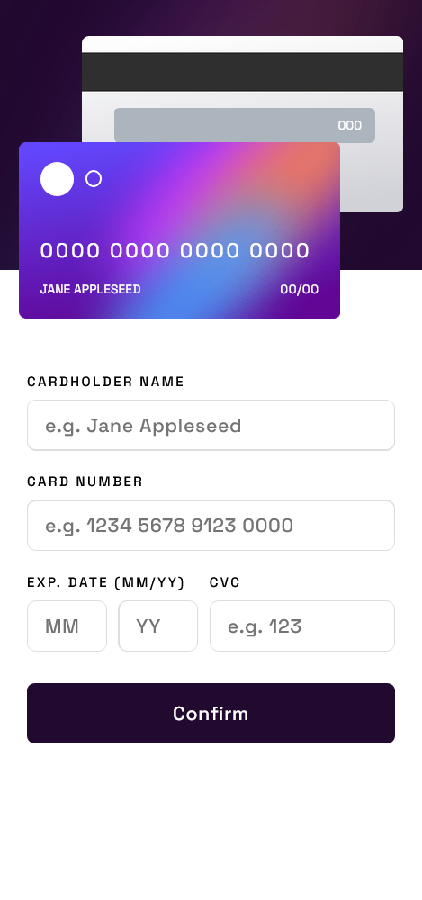

# Frontend Mentor - Interactive card details form solution

This is a solution to the [Interactive card details form challenge on Frontend Mentor](https://www.frontendmentor.io/challenges/interactive-card-details-form-XpS8cKZDWw). Frontend Mentor challenges help you improve your coding skills by building realistic projects.

## Table of contents

- [Overview](#overview)
  - [The challenge](#the-challenge)
  - [Screenshot](#screenshot)
  - [Links](#links)
- [My process](#my-process)
  - [Built with](#built-with)
  - [What I learned](#what-i-learned)
  - [Continued development](#continued-development)
  - [Useful resources](#useful-resources)
- [Author](#author)
- [Acknowledgments](#acknowledgments)

## Overview

### The challenge

Users should be able to:

- Fill in the form and see the card details update in real-time
- Receive error messages when the form is submitted if:
  - Any input field is empty
  - The card number, expiry date, or CVC fields are in the wrong format
- View the optimal layout depending on their device's screen size
- See hover, active, and focus states for interactive elements on the page

### Screenshot




### Links

- Solution URL: [@Timbar09](https://github.com/Timbar09/FEM-Interactive-card-details-form.git)
- Live Site URL: [Interactive-card-details-form](https://timbar09.github.io/FEM-Interactive-card-details-form/)

## My process

### Built with

- Semantic HTML5 markup
- CSS custom properties
- Flexbox
- CSS Grid
- Mobile-first workflow
- Vanilla JavaScipt
- [SASS](https://sass-lang.com/) - For styles

### What I learned

On this project I learned JavaScript DOM Traversal. This skill allowed me to manipulate the DOM in a way that was previosly oblivios to me. It allowed me to write cleaner code.

I learned more about form validation with javaScript. Previously I validated forms directly on the HTML markup but this time I was able to write my own validation code through javaScript.

I also managed to learn about the EventListener "input" which I had never used before.

The code down below shows how I used JavaScript DOM Traversal:

```js
form.addEventListener('submit', (e) => {
  formInputs.forEach((input) => {
    let messages = [];
    const inputGrandParent = input.closest('.form__group');
    const inputParent = input.parentElement;
    let errorMsg = inputGrandParent.querySelector('.form__error-messsage');
  }
});
```

### Continued development

This was the first challege that required me to use javaScript. I learned a lot and I also have lot to learn. I want to do more Javascript challenges and continue to push myself and learn even more.

### Useful resources

- [Web Dev Simplified](https://www.youtube.com/watch?v=v7rSSy8CaYE&t=720s) - This helped me learn about JavaScript DOM Traversal and how to use it properly.
- [MDN](https://developer.mozilla.org/en-US/) - This is an amazing website which helped form validation. I'd recommend it to anyone still learning this concept.

## Author

- Website - [Add your name here](https://www.your-site.com)
- Frontend Mentor - [@yourusername](https://www.frontendmentor.io/profile/yourusername)
- Twitter - [@Milez09](https://www.twitter.com/@Milez09)

## Acknowledgments

A huge shout out to all software development youtubers, educational sites such as MDN, Stackoverflow, FreeCodeCamp and so on, for sharing your knowledge amd helping people across the globe who genuenly want to learn sotware development.
